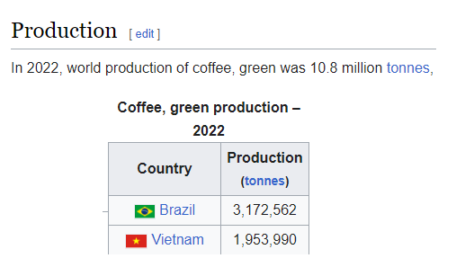
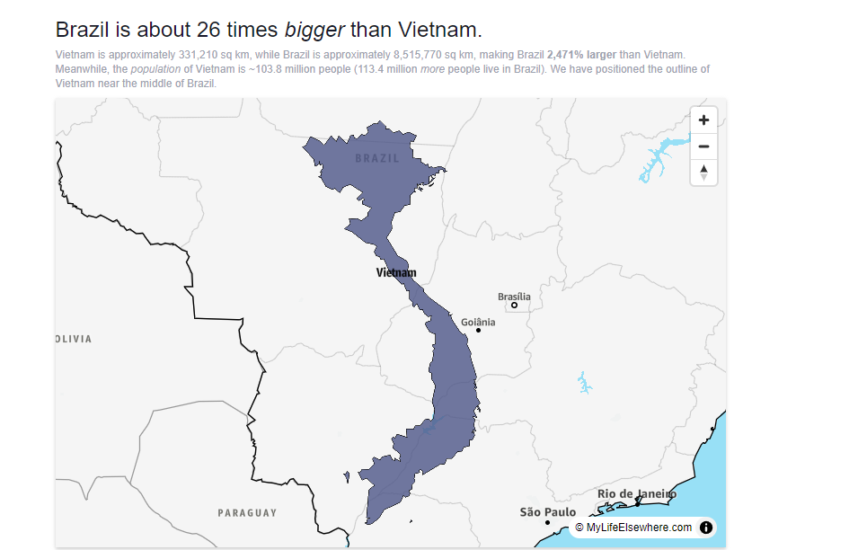
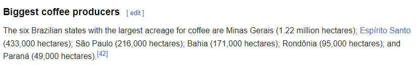

## Purpose
(This repo is a very quick and dirty study and strategy implementation to remember some core concepts of data analisys and treatment and Backtrader functionalities. It should not be used as a financial tool in any way, shape or form.)
A small study about how the weather in Brasil may influence the price of coffee futures and a proposed trading strategy to make use of that relation.

## Scripts Folder
- *dataAnalysis,ipynb*: cleans up the weather data for Brasil weather stations and does some study about correlation with coffee price for day,  month or year time periods
- *tradingStrategy.ipynb*: implements a buying and selling strategy in Backtrader using the previously cleaned up weather data. It does so in a month-to-month basis
(inspired by the Peter James book: Billionaire )

## Basic Initial Research
- Access which are the countries that produce more coffee:

- Choose the largest and with highet production for simplicity sake:

- See which are the highest producing states in Brasil so we simplify the data process even further (again for simplicity sake):

